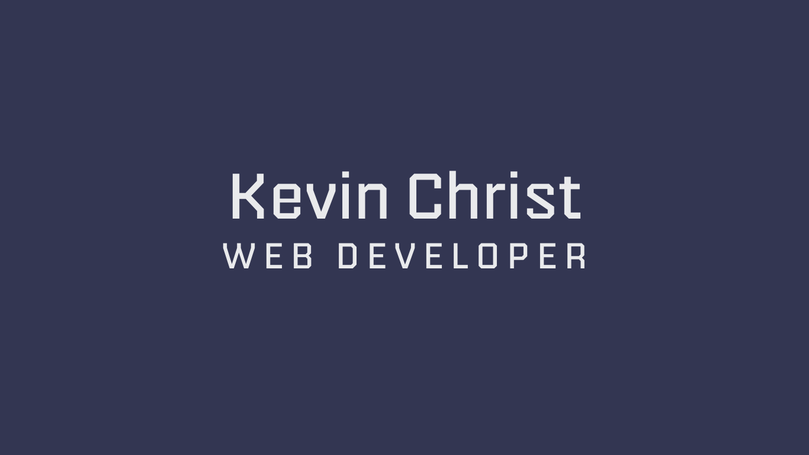
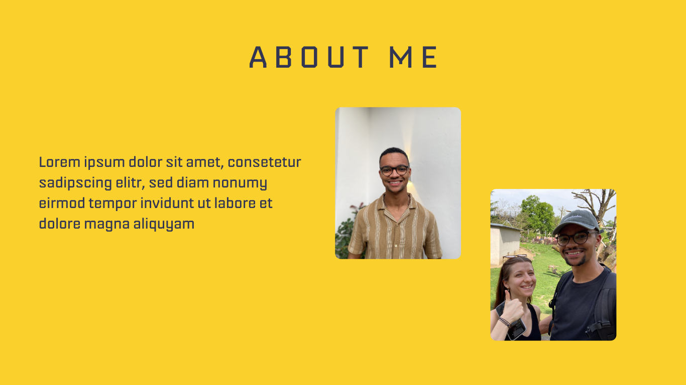
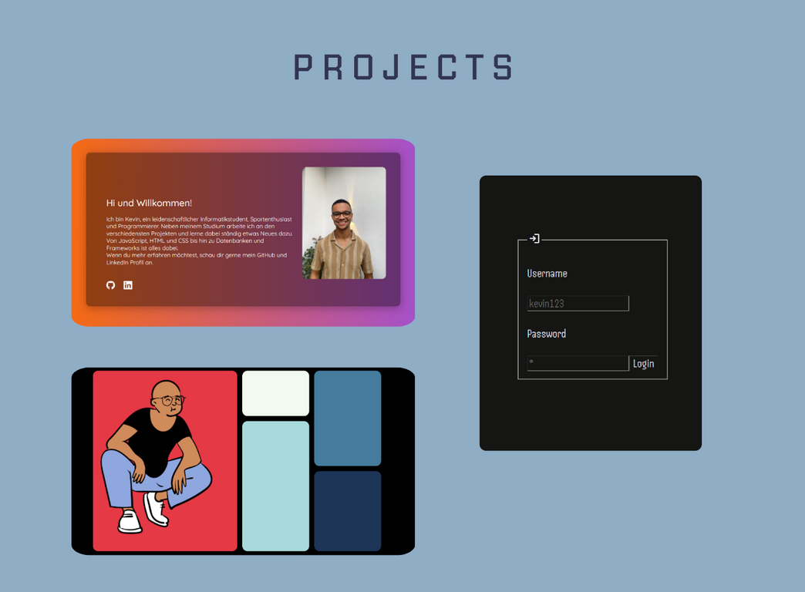
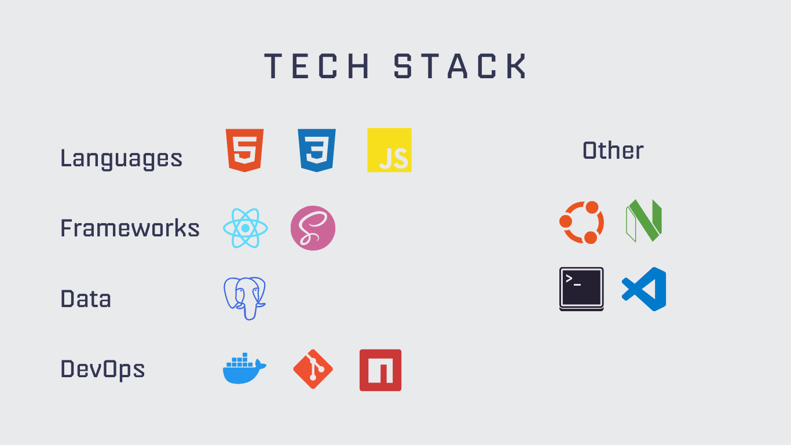

# Project Website

## Introduction
Hello! I'm Kevin Christ, a computer science stundent and self-taught
Web-Developer. This Website is my personal space where I introduce myself,
showcase my projects and share the technologies I work with.
This site reflects my journey and the skills I've acquired over the years.

## Mockups
I created these Mockups with Canva.

## Ressources
- The Icons are from [simpleicons](https://simpleicons.org/)
- The Font is from [fontshare](https://www.fontshare.com/)

## Contact

Feel free to reach out to me through any of the following channels:

- [LinkedIn](https://www.linkedin.com/in/kevin-christ-b71b82204/)
- [GitHub](https://github.com/KevinChrist02)